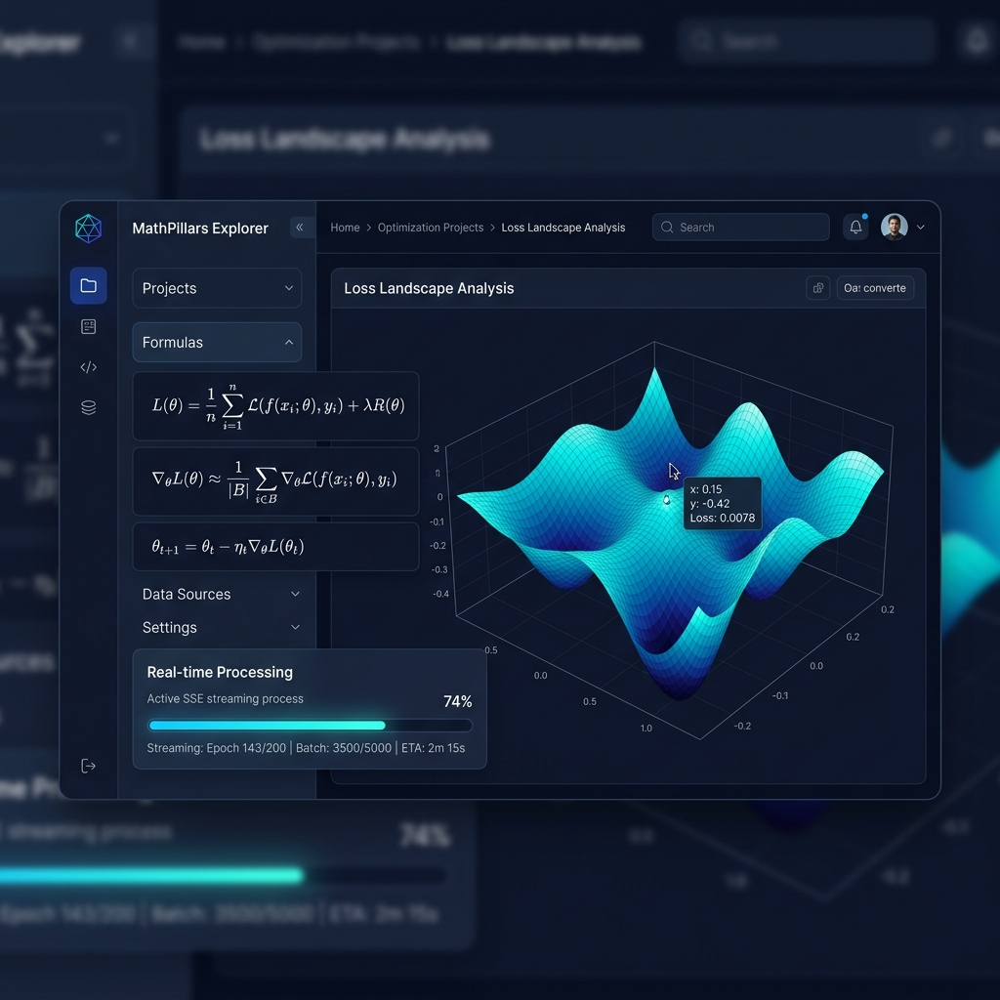

# MathPillars Explorer: A Anatomia Matematica da Inteligencia Artificial

## Descricao Geral

MathPillars Explorer e um laboratorio interativo de alta performance desenvolvido em .NET 10, concebido para formalizar, visualizar e experimentar os tres pilares matematicos fundamentais que sustentam os sistemas de Inteligencia Artificial modernos. O sistema oferece um ambiente rigoroso de exploracao matematica, combinando formalizacao teorica em LaTeX com experimentos interativos de alta fidelidade visual.

O projeto e destinado a profissionais de aprendizado de maquina, professores, pesquisadores e autodidatas avancados que buscam compreender a matematica subjacente a modelos de linguagem de grande escala, redes neurais profundas e sistemas de inteligencia artificial geral.

## Pilares Matematicos

### Pilar A: Algebra Linear — O Espaco de Representacao

A algebra linear constitui o fundamento estrutural de toda representacao computacional de conhecimento. Tensores, vetores e matrizes sao os instrumentos pelos quais conceitos abstratos sao codificados em espacos latentes de alta dimensionalidade. Este modulo explora decomposicoes matriciais como SVD e PCA, produto escalar, similaridade de cosseno e a teoria dos autovetores e autovalores.

### Pilar B: Calculo Multivariavel — O Mecanismo de Ajuste

O calculo multivariavel e o mecanismo pelo qual sistemas de inteligencia artificial aprendem. Gradientes, derivadas parciais e a regra da cadeia (backpropagation) permitem que o sistema navegue superficies de custo de alta dimensionalidade em busca de minimos globais. Este modulo examina as matrizes Jacobiana e Hessiana e compara otimizadores de primeira ordem (AdamW) com otimizadores de segunda ordem (Sophia).

### Pilar C: Probabilidade e Estatistica — O Gerenciamento da Incerteza

A probabilidade fornece o framework epistemico pelo qual sistemas de IA quantificam e gerenciam a incerteza inerente a dados do mundo real. O Teorema de Bayes, distribuicoes gaussianas, entropia de Shannon e a funcao de custo Cross-Entropy sao os instrumentos fundamentais deste dominio.

## Arquitetura do Sistema

O sistema adota a arquitetura Blazor WebAssembly com ASP.NET Core Backend, implementada com Vertical Slice Architecture no servidor. Esta escolha desacopla naturalmente o motor de calculo matematico (MathCore) da camada de visualizacao e interacao (VisualUI).

```
MathPillarsExplorer.sln
├── src/
│   ├── MathPillars.Api       (ASP.NET Core Web API — MathCore)
│   └── MathPillars.Web       (Blazor WebAssembly — VisualUI)
└── testes/
    └── MathPillars.Testes    (xUnit + FluentAssertions)
```

O backend expoe endpoints REST sincronos para calculos leves e endpoints SSE (Server-Sent Events) assincronos para calculos computacionalmente intensos, garantindo que a interface do usuario permanca responsiva durante processamentos longos.

## Stack Tecnologica

| Camada             | Tecnologia               | Finalidade                            |
| ------------------ | ------------------------ | ------------------------------------- |
| Runtime            | .NET 10                  | Plataforma principal                  |
| Backend            | ASP.NET Core 10          | Web API REST + SSE                    |
| Frontend           | Blazor WebAssembly 10    | Interface interativa                  |
| Matematica         | MathNet.Numerics         | SVD, PCA, decomposicoes, estatistica  |
| Visualizacao 3D    | Plotly.NET               | Loss Landscape, espacos vetoriais     |
| Visualizacao 2D    | ScottPlot                | Distribuicoes, gradientes             |
| Renderizacao LaTeX | KaTeX / MathJax          | Formalizacao matematica em tempo real |
| Testes             | xUnit + FluentAssertions | Validacao dos algoritmos do MathCore  |

## Decisoes Arquiteturais

O sistema e completamente stateless: nao ha autenticacao, banco de dados, historico de sessoes ou persistencia de estado. Esta decisao concentra toda a complexidade no dominio matematico, eliminando overhead de infraestrutura desnecessario para um laboratorio interativo.

O processamento assincrono com SSE garante que calculos de longa duracao, como decomposicao SVD em matrizes de grande porte e geracao de superficies Loss Landscape tridimensionais, nao bloqueiem a interface do usuario. O progresso e transmitido em tempo real atraves do modelo `ResultadoSSE<T>`.

## Modulos e Experimentos

### Modulo A — Algebra Linear

Experimentos disponibilizados: Produto Escalar e Projecao, Similaridade de Cosseno Semantica, Decomposicao SVD e PCA Interativo.

### Modulo B — Calculo Multivariavel

Experimentos disponibilizados: Loss Landscape 3D, Comparador AdamW versus Sophia, Backpropagation Visual com regra da cadeia etapa a etapa.

### Modulo C — Probabilidade e Estatistica

Experimentos disponibilizados: Teorema de Bayes Interativo, Gaussiana Dinamica, Cross-Entropy Loss.

## Estrutura de Diretorios

```
/
├── README.md
├── G.MD                        (Guia mestre do projeto — PRD)
├── .gitignore
├── analise/                    (17 diagramas PlantUML: 13 UML + 4 C4)
└── desenvolvimento/
    └── MathPillarsExplorer/
        ├── MathPillarsExplorer.sln
        ├── src/
        │   ├── MathPillars.Api/
        │   └── MathPillars.Web/
        └── testes/
            └── MathPillars.Testes/
```

## Diagramas de Analise

A pasta `analise/` contem os dezessete diagramas formais do sistema, organizados conforme os padroes UML 2.5 e o modelo C4:

- Treze diagramas UML: Caso de Uso, Classes, Sequencia, Comunicacao, Estados, Atividade, Componentes, Implantacao, Pacotes, Objetos, Estrutura Composta, Temporizacao e Visao Geral de Interacao.
- Quatro diagramas C4: Contexto, Container, Componente e Codigo.

## Requisitos Nao-Funcionais

O sistema impoe limites de entrada para garantir estabilidade: matrizes com dimensoes de ate 1000 por 1000 elementos e datasets com ate 10.000 pontos de dados. Calculos que excedam 500 milissegundos sao automaticamente tratados como operacoes assincronas com transmissao de progresso via SSE. A cobertura de testes unitarios do MathCore deve superar 80 por cento.

## Convencoes de Codigo

Todas as declaracoes de variaveis, nomes de funcoes, classes e objetos seguem obrigatoriamente o idioma Portugues do Brasil. Classes utilizam PascalCase e variaveis e funcoes utilizam camelCase. O unico tipo de comentario permitido e o summary do C#. Nenhuma outra forma de comentario e tolerada no codigo-fonte.


# MathPillars Explorer: Laboratorio de Formalismo Matematico para Inteligencia Artificial

Este repositorio contem a implementacao academica e experimental de um ecossistema focado na exploracao de modelos matematicos fundamentais para a Inteligencia Artificial. O escopo principal reside em modelar e visualizar abstrações de Álgebra Linear, Cálculo Multivariável e Teoria das Probabilidades, utilizando o ecossistema .NET 10 para processamento numérico rigoroso e interfaces reativas via Blazor WebAssembly.

A aplicacao possui uma interface interativa de alto nivel, inspirada em padroes esteticos premium (Design "Toss"), responsavel por demonstrar visualmente o comportamento de algoritmos complexos em tempo real. O sistema utiliza Server-Sent Events (SSE) para transmitir o progresso de calculos computacionalmente intensos, garantindo uma experiencia de usuario fluida e informativa.



*Figura 1:* Interface do MathPillars Explorer demonstrando a visualizacao 3D de uma Loss Landscape, formulas matematicas em LaTeX e monitoramento de processamento SSE em tempo real.

A visualizacao e composta por tres eixos principais:
- **Painel de Experimentacao**: Area interativa para ajuste de parametros e execucao de algoritmos.
- **Visualizacao Formal**: Renderizacao de formulas matematicas via KaTeX, preservando a notacao academica.
- **Monitoramento de Fluxo**: Feedback em tempo real sobre o estado do processamento assincrono no Backend.

## 2. Embasamento Teórico

O MathPillars Explorer fundamenta-se na convergencia de tres pilares matematicos que constituem a espinha dorsal da aprendizagem de maquina moderna.

### 2.1 Álgebra Linear: O Espaço de Representação
A representacao de dados em IA ocorre predominantemente em espacos vetoriais de alta dimensionalidade. O projeto implementa a **Decomposicao em Valores Singulares (SVD)**, fatorando uma matriz $A$ em $U\Sigma V^T$, permitindo a compressao de informacao e a extracao de componentes latentes. Complementarmente, a **Analise de Componentes Principais (PCA)** e utilizada para a reducao de dimensionalidade, preservando a variancia maxima dos dados.

### 2.2 Cálculo Multivariável: O Mecanismo de Ajuste
A otimizacao de modelos de rede neural depende intrinsicamente do calculo de gradientes. O projeto explora a **Matriz Jacobiana** para transformacoes vetoriais e a topografia de **Loss Landscapes**. Sao implementados comparativos entre otimizadores de primeira ordem (como **AdamW**) e otimizadores de segunda ordem (como **Sophia**), que utilizam informacoes de curvatura (Hessiana) para acelerar a convergencia em superficies complexas.

### 2.3 Probabilidade e Estatística: O Gerenciamento da Incerteza
A inferencia em sistemas inteligentes e regida pelo **Teorema de Bayes**, que permite a atualizacao da probabilidade de uma hipotese a medida que novas evidencias sao apresentadas. O modulo abrange tambem a modelagem via **Distribuicoes Gaussianas** e o calculo de **Entropia Cruzada**, essencial para a definicao de funcoes de perda em classificadores probabilisticos.

## 3. Disposição Arquitetural

O repositorio e concebido sob um paradigma estrito de separacao de responsabilidades, composto pelos seguintes pilares de sustentacao tecnica:

- **/analise**: Diretorio mandatorio de escopo arquitetural, centralizando a especificacao de software elaborada. Contem a integralidade dos 13 diagramas UML e 4 diagramas C4 Model, produzidos formalmente sob o padrao PlantUML.
- **/desenvolvimento**: Segmento de codigo-fonte que implementa a inteligencia e as interfaces.
    - **MathPillars.Api**: Backend em ASP.NET Core 10 focado em processamento numerico pesado e streaming SSE.
    - **MathPillars.Web**: Frontend em Blazor WebAssembly responsavel pela visualizacao reativa.
    - **MathPillars.Comum**: Biblioteca de contratos e tipos primitivos compartilhados.

## 4. Tecnologias Empregadas

- **Plataforma Computacional**: .NET 10.
- **Processamento Numerico**: MathNet.Numerics.
- **Interface Reativa**: Blazor WebAssembly com CSS Vanilla.
- **Comunicacao**: Server-Sent Events (SSE) com IAsyncEnumerable.
- **Tipografia Matematica**: KaTeX para renderizacao de formalismo LaTeX.
- **Testes Automatizados**: xUnit e FluentAssertions.

## 5. Diretrizes de Lógica

Toda a orquestracao do programa prioriza a soberania do C# tanto no servidor quanto no cliente (WASM). A comunicacao entre camadas e estritamente tipada atraves do projeto Comum, eliminando inconsistencias de contrato. A logica matematica e isolada em servicos puros, facilitando a testabilidade e a reutilizacao em diferentes contextos de execucao.

## 6. Análise Estrutural e Comportamental (Galeria de Arquitetura)

Em estrita conformidade com as especificações exigidas de governança de repositório, apresentamos a seguir a visão descritiva para a integralidade dos **17 diagramas fundamentais**. Estas plantas estruturais evidenciam a pureza e a escalabilidade do MathPillars Explorer.

### 6.1 C4 Model

- **Contexto de Software (`14-c4-contexto.puml`)**: Documenta a interacao do usuario com o sistema, evidenciando as fronteiras entre o frontend, a API de calculo e os limites do sistema.
- **Diagrama de Container (`15-c4-container.puml`)**: Expoe a divisao entre o cliente WebAssembly e o servidor ASP.NET Core, detalhando os protocolos de comunicacao (HTTP/SSE).
- **Diagrama de Componente (`16-c4-componente.puml`)**: Subdivide os binarios em modulos logicos (Algebra, Calculo, Probabilidade), demonstrando como os servicos de calculo sao encapsulados.
- **Diagrama de Codigo (`17-c4-codigo.puml`)**: Detalha as classes nucleares de processamento, como os servicos SSE e os tipos primitivos (Vetor, Matriz).

### 6.2 Unified Modeling Language (UML)

- **Caso de Uso (`01-diagrama-caso-de-uso.puml`)**: Delimita as acoes disponiveis ao usuario, como a configuracao de experimentos matematicos e o monitoramento de resultados.
- **Diagrama de Classes (`02-diagrama-classes.puml`)**: Mostra a hierarquia de tipos e as relacoes entre controladores, servicos de calculo e modelos de dados.
- **Diagrama de Sequencia (`03-diagrama-sequencia.puml`)**: Ilustra o fluxo temporal de uma solicitacao de calculo via SSE, desde o disparo no cliente ate a recepcao final dos dados.
- **Diagrama de Comunicacao (`04-diagrama-comunicacao.puml`)**: Foca na troca de mensagens entre os objetos do sistema para realizar uma decomposicao matematica.
- **Maquina de Estado (`05-diagrama-estados.puml`)**: Documenta os estados do processamento assincrono (Ocioso, Calculando, RecebendoDados, Concluido).
- **Diagrama de Atividade (`06-diagrama-atividade.puml`)**: Macro-fluxo processual do calculo de um experimento, incluindo validacoes de entrada e transformacoes de dados.
- **Componentes (`07-diagrama-componentes.puml`)**: Reforca a modularidade do sistema e as dependencias entre o motor matematico e a camada de visualizacao.
- **Implantacao (`08-diagrama-implantacao.puml`)**: Descreve como os artefatos (.dll, .wasm) sao distribuídos no ambiente de execucao.
- **Pacotes (`09-diagrama-pacotes.puml`)**: Demarca a divisao semantica do projeto em namespaces organizados por responsabilidade.
- **Objetos (`10-diagrama-objetos.puml`)**: Snapshot das instancias em memoria durante a execucao de um experimento de PCA.
- **Estrutura Composta (`11-diagrama-estrutura-composta.puml`)**: Detalha a composicao interna de modulos complexos, como o motor de otimizacao.
- **Temporizacao (`12-diagrama-temporizacao.puml`)**: Analisa a latencia e o comportamento temporal das atualizacoes de progresso via SSE.
- **Visao Geral de Interacao (`13-diagrama-visao-geral-interacao.puml`)**: Combina elementos de sequencia e atividade para fornecer uma visao holistica do sistema.
